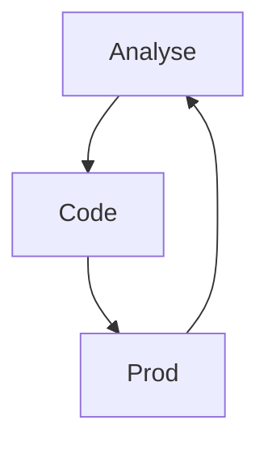

<h2>Hey 👋, I'm Fab's </h2>
 

I a Web3.0 Developer 🚀 from France. I enjoy life.

- 🔭 I’m currently on some dapps
- 🌱 I’m currently learning Rust
- 💬 I am fast to respond and looking for people willing to grow their profiles by contributing regularly;
- ⚡ Fun fact: I'm a memes necromancer.

  
  ### Languages and Tools:

            

          
 
 

### My daily routine :

  
### ⭐ GitHub Stats

